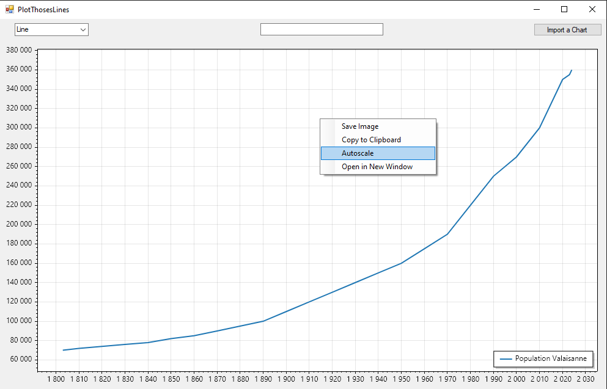

# P_Fun

## Concevoir un logiciel pour afficher des graphiques sur des données

Utilisez les fichiers .CSV dans /doc pour tester l'app.

-population_romandie.csv -> tout les cantons romands 1803-2024

-population_valais.csv -> valais 1803-2024

-population_vaud.csv -> vaud 1803-2024

-population_vaud -prédictions.csv -> vaud 2025-2050

## Quand on rajoute une donnée, il est possible que ça ne soit pas bien centrée, faites clique droit puis "Autoscale"

